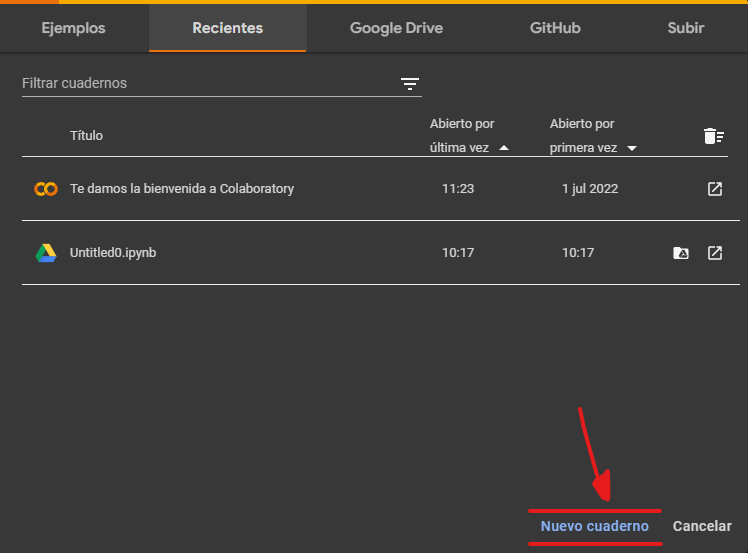
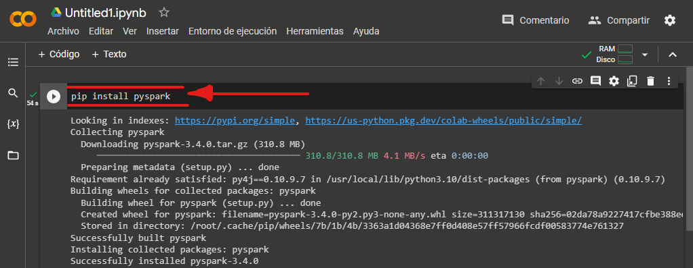
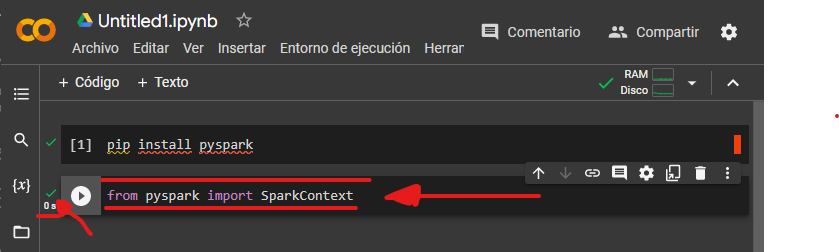
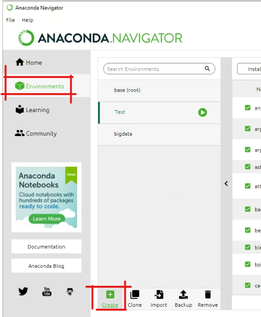
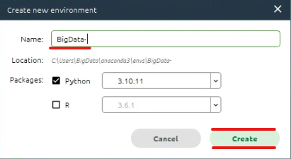
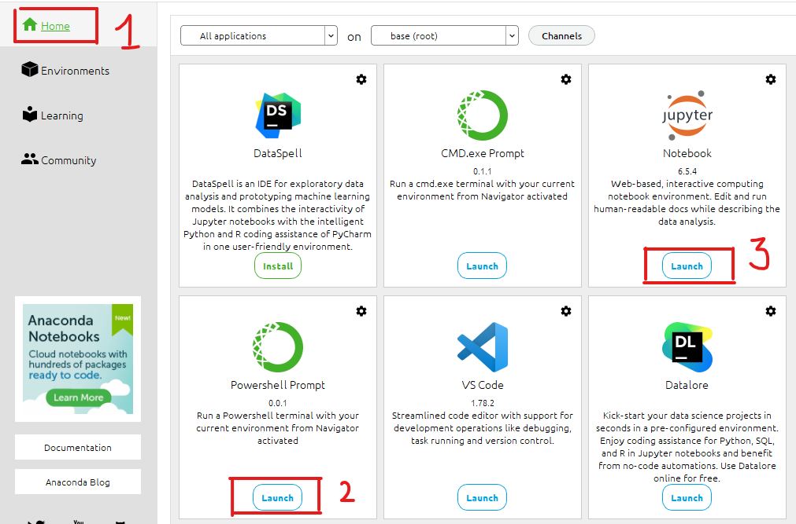
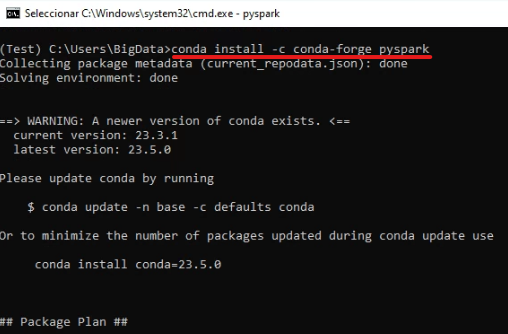
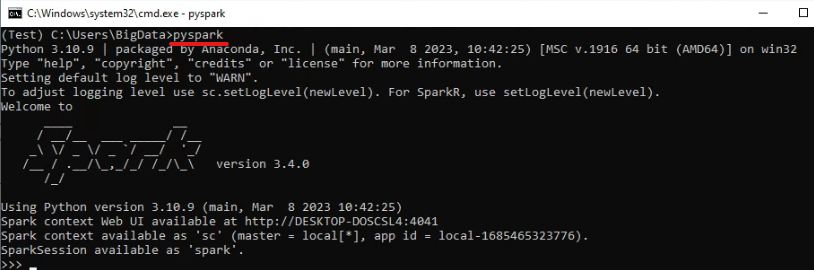
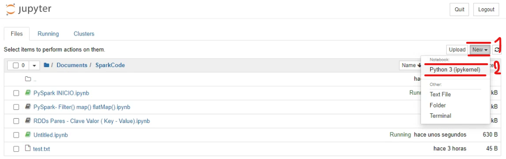
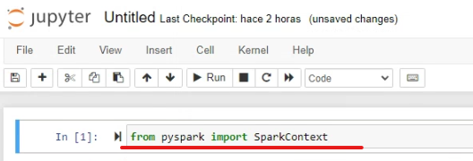

## __Instalación__:
`Podemos elegir entre 2 ambientes para llevar a cabo las actividades propuestas con PySpark.`
#### __Usando Google Colab__:  
__Ventaja__: Instalación rápida, usarás recursos de Google por lo tanto no se usarán los recursos de tu computadora, compilaciones más veloces ya que Google Colab nos da aproximadamente 10GB de RAM y GB de Disco.  

__Desventaja__:  Tendrás que instalar el pyspark cada vez que tu sesión termine en Google Colab.  

1.Nos dirigimos a [Google Colab](https://colab.research.google.com).  

2.Crear un nuevo cuaderno haciendo click en `Nuevo Cuaderno`.
  
3.Se abrirá una hoja de trabajo al estipo de Jupiter Notebook.  ´

4.Ejecutamos el comando usando `pip` (**P**ackage **I**nstaller for **P**ython):  
```shell 
pip install pyspark
```  
  
5.Cuando se haya instalado ya podemos usar comandos de PySpark:  
```shell 
from pyspark import SparkContext
```
  
#### __Usando Anaconda__:  
__Ventaja__: No tendrás que volver a instalar pyspark ya que estará en tu sistema local, no dependerás de servicios de terceros.  

__Desventaja__:  Proceso de instalación un poco más tardado, se usarán recursos de tu máquina así que puede que algunas consultas demoren ya que dependerá de la capacidad de tu equipo.  

1.Nos dirigimos a [la página oficial de descarga de Anaconda](https://www.anaconda.com/download).  
 
2.Descargamos e instalamos Anaconda, una vez instalada nos dirigimos a la sección `Environments` y luego a `Create`.
  

3.Creamos un nuevo ambiente de desarrollo al cual llamaremos  `BigData`.  
  
4.Una vez que Anaconda termine de crear el ambiente de desarrollo nos dirigimos a `Home` e instamos `Jupyter Notebook` y `PowerShell Prompt`  
  
5.Una vez instaladas ambas herramientas Abrimos primero el `PowerShell Prompt` haciendo click en `LAUNCH`.  

6.Una vez en la terminal ejecutamos el comando:
```shell
conda install -c conda-forge pyspark
```  
 
Y luego confirmamos con "Y"  

7.Una vez instalado ejecutamos el comando:
```shell
pyspark
```
 

8.Abrimos `Jupyter Notebook` dándole a `LAUNCH`, una vez abierto el Jupyter crearemos un archivo similar al cuaderno del google Colab. Para eso primero nos ubicamos en alguna carpeta donde querramos crear nuestros archivos de pruebas. Luego en la parte superior derecha click a `New` y `Python 3 ipykernel`.  
   
9.Una vez creado el archivo kernel, ya podemos ejecutar dentro el comando:
```shell
from pyspark import SparkContext
```
No debería mostrar ningún error.
  

## __TODO LISTO, ¡YA PODEMOS EMPEZAR A CODIFICAR!__
